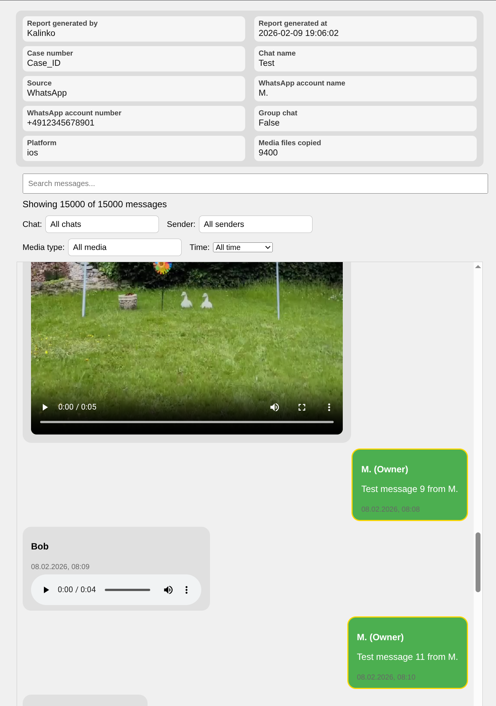

Bubbly – Bubble your chats

[](https://github.com/kalink0/bubbly/actions/workflows/build.yml)


[](https://github.com/kalink0/bubbly/releases)
[](LICENSE)
[](https://www.python.org/downloads/)

## Overview

Bubbly generates an interactive HTML chat view with search, filters, time filtering, and media previews for chats from different messengers/exports.

Limitation:
- No print/PDF report export functionality is currently included in Bubbly.

It currently supports:

- WhatsApp chat exports (iOS and Android)
- Telegram Desktop exports (JSON)
- Wire Messenger unencrypted backups (.wbu/.zip with .binpb files).
- Threema Messenger backups (CSV-based backup folder/zip).
- Generic JSON chat exports (single JSON or multiple JSONs in a folder/zip).



## Usage

Interactive menu (guided setup):

```bash
python messenger/bubbly/bubbly_launcher.py --interactive
```

You can also start without arguments and Bubbly will open the interactive menu automatically.

CLI usage (all required args on the CLI):

```bash
python messenger/bubbly/bubbly_launcher.py \
  --parser whatsapp_export \
  --input /path/to/chat_export.zip \
  --output /path/to/output \
  --creator "Analyst Name" \
  --case CASE-123 \
  --logo /path/to/logo.png \
  --parser_args platform=android wa_account_name="Owner Name" wa_account_number="+123"
```

Short flag equivalent:

```bash
python messenger/bubbly/bubbly_launcher.py \
  -p whatsapp_export \
  -i /path/to/chat_export.zip \
  -o /path/to/output \
  -u "Analyst Name" \
  -k CASE-123 \
  --logo /path/to/logo.png \
  -a platform=android wa_account_name="Owner Name" wa_account_number="+123"
```

Config file usage (optional `default_conf.json` next to the launcher, or `--config` to point to another file). CLI args override config values. `parser_args` merges config and CLI (CLI wins on conflicts).

```bash
python messenger/bubbly/bubbly_launcher.py --config /path/to/config.json
```

Example config:

```json
{
  "parser": "whatsapp_export",
  "input": "/path/to/chat_export.zip",
  "output": "/path/to/output",
  "creator": "Analyst Name",
  "case": "CASE-123",
  "logo": "/path/to/logo.png",
  "split_by_chat": true,
  "parser_args": {
    "platform": "android",
    "wa_account_name": "Owner Name",
    "wa_account_number": "+123",
    "chat_name": "Chat Export"
  }
}
```

Notes:
- `--parser` / `-p` must be one of: `whatsapp_export`, `telegram_desktop_export`, `wire_messenger_backup`, `threema_messenger_backup`, `generic_json`.
- Split-by-chat export is the default. Use `--no-split-by-chat` (or config `split_by_chat: false`) for a single merged HTML.
- `parser_args` are parser-specific.
  - For WhatsApp Chat Exports: `platform`, `wa_account_name` (optional), `wa_account_number` (optional), `chat_name` (optional).
  - For Telegram Desktop exports (JSON): `tg_account_name`.
  - For Wire Messenger backups: no parser-specific args. Only unencrypted backups are supported.
  - For Threema Messenger backups: `threema_account_name` (optional).
    Threema exports are typically password-encrypted ZIP files; Bubbly currently expects the already decrypted/extracted backup contents (CSV/media files).
  - For Generic JSON: `json_file` (optional), `messages_key` (optional), `metadata_key` (optional), `account_name` (optional).

## Generic JSON schema

You can provide:
- A single `.json` file
- A folder or zip containing one or more `.json` files (each JSON is treated as a chat and merged into one report)

Required (per message):
- `sender`
- `timestamp` (ISO 8601, seconds required; timezone optional)
- `content` (or `text` / `message`)

Optional (per message):
- `media` (string path or object/list containing a path)
- `url`
- `is_owner`
- `chat` (or `chat_name`)

Optional (top-level):
- `chat_name`
- `metadata` (object)
- `source`
- `platform`

Minimal example:

```json
{
  "chat_name": "Example Chat",
  "messages": [
    {
      "sender": "Alice",
      "timestamp": "2026-02-01T12:34:56Z",
      "content": "Hello"
    }
  ]
}
```

## CSV to JSON utility

For non-programmers, you can create a Bubbly-compatible JSON from a CSV file (that is a possible output from different tools and sqlitebrowser) using:

```bash
python csv_to_bubbly_json.py \
  --csv /path/to/messages.csv \
  --output /path/to/chat.json \
  --messenger whatsapp \
  --source "SQLite export" \
  --chat_name "Team Chat" \
  --map sender=person timestamp=ts content=message media=file_path
```

How mapping works:
- Left side is the Bubbly message field.
- Right side is your CSV column name.

Accepted mapping target fields:
- Mandatory: `sender`, `timestamp`, `content`
- Optional: `media`, `url`, `is_owner`, `chat`

Field meanings:
- `sender`: message author name.
- `timestamp`: message timestamp (ISO 8601, seconds required).
- `content`: message text.
- `media`: media file path/name (optional).
- `url`: URL linked to the message (optional).
- `is_owner`: whether this message is from the owner/account (`true/false`, `1/0`, `yes/no` accepted).
- `chat`: chat name per message (optional, useful for merged datasets).

Example:
- `sender=person` means CSV column `person` becomes JSON field `sender`.

Notes:
- `timestamp` values must already be ISO 8601 (for example `2026-02-01T12:34:56`; format `%Y-%m-%dT%H:%M:%S`).
- Rows missing required values are skipped by default.
- Use `--strict` to fail instead of skipping invalid rows.
- Script doesn't take care of media file - The media must be copied to the path given in the column media -> should be relative to the newly created json.

To create this CSV you can use DB Browser for SQLite or run a query directly:
```bash
sqlite3 /path/to/db.sqlite -header -csv \
  "SELECT person, ts, message, file_path FROM messages;" \
  > /tmp/messages.csv
```

## Executable builds

Build scripts and build-only dependencies are in `build/`.
See `build/README.md` for Linux and Windows executable build instructions.
